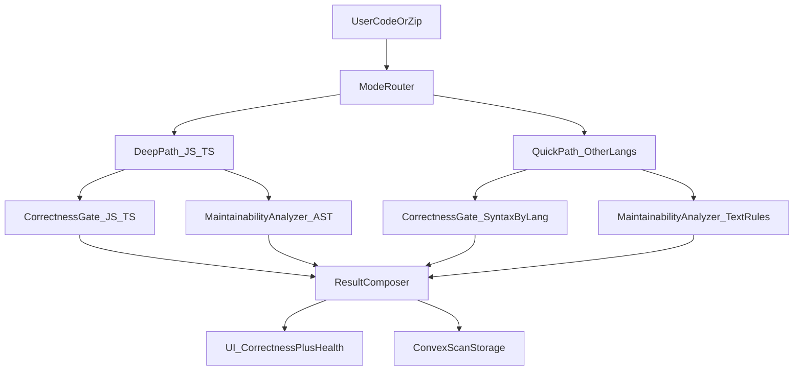

# Codentia Execution Plan (Health + Correctness)

## Objective
Evolve Codentia from a strong maintainability analyzer into a maintainability + basic correctness analyzer, without overpromising runtime bug detection.

## Scope Principles
- Keep current "code health" strengths intact.
- Add correctness as a gate (not blended into one vague score).
- Ship incrementally: JS/TS first, then quick-scan languages.
- Be explicit in UI about what is and is not validated.
- Non-negotiable UI rule: if Correctness = fail, the user must see it before any score/grade.

## Phase 0: Baseline and Product Contract

### Focus
Lock feature definition and messaging before implementation.

### Work
- Define two outputs:
  - Correctness Gate: syntax/type/lint status
  - Maintainability Score: existing structural metrics
- Add product wording updates in `README.md` to prevent "valid code guaranteed" interpretation.
- Document guarantees per mode:
  - Deep (JS/TS): syntax-aware + structural
  - Quick (others): structural now, syntax support rolling out

### Deliverables
- Updated capability matrix in README.
- Finalized user-facing terms for UI badges and warnings.

### Exit Criteria
- Anyone reading README can clearly distinguish correctness vs maintainability.

## Phase 1: JS/TS Correctness Gate (Core)

### Focus
Add reliable correctness signal for highest-usage path.

### Work
- In `lib/analyzer/parser.ts`, capture parse errors (not just recovery).
- In `app/api/analyze/route.ts`:
  - Return correctness payload:
    - `status: pass|fail|unknown`
    - `syntaxErrors[]`
    - optional `lintErrors[]`
  - If correctness fails, cap maintainability score at 60 and show correctness first in UI.
- Extend analyzer types in `lib/analyzer/types.ts` to include correctness result.
- Optional substep: add lightweight lint checks for JS/TS (unused vars/imports, obvious issues).

### Deliverables
- API returns correctness gate alongside maintainability output.
- JS/TS syntax errors displayed as first-class issues.

### Exit Criteria
- Broken JS/TS code is never shown as "healthy" without a correctness warning/fail.

## Phase 2: UI Correctness Section + Safety Messaging

### Focus
Prevent user misinterpretation in results pages.

### Work
- Update `app/analyze/page.tsx` and `app/project/page.tsx` to show:
  - Correctness Gate card (Pass/Fail/Not checked)
  - Deep/Quick mode badge
  - Warning banner when correctness is unavailable or unknown
- Add minimal styling in `app/globals.css`.
- Update home hints in `app/page.tsx` to set expectations before analyze.

### Deliverables
- Always-visible correctness status in result UI.
- Safer copy for junior developers.

### Exit Criteria
- A user cannot mistake "maintainability score" for "code is syntactically valid."

## Phase 3: Quick Languages Syntax Validation (Python + Go first)

### Focus
Add syntax checking for non-JS/TS where ROI is best.

### Work
- Add backend syntax-check service abstraction (language -> checker).
- Start with:
  - Python parse check
  - Go parse check
- Integrate into `app/api/analyze/route.ts` and ZIP route `app/api/analyze-zip/route.ts`.
- Preserve current quick structural checks from `lib/analyzer/textAnalyzer.ts` and language modules in `lib/analyzer/languages`.

### Deliverables
- Python/Go have syntax gate + maintainability results.
- Clear fallback behavior for unsupported language syntax checks.

### Exit Criteria
- Quick mode supports real syntax checks for at least Python and Go.

## Phase 4: ZIP-Level Correctness Aggregation

### Focus
Project scan should report correctness at file and project level.

### Work
- In `app/api/analyze-zip/route.ts`:
  - Track per-file correctness status
  - Project summary fields:
    - files failed syntax
    - files unchecked
    - correctness confidence band
- In `lib/analyzer/aggregate.ts`, add correctness aggregation logic.
- Display summary in project results UI.

### Deliverables
- Project report shows both maintainability and correctness distribution.

### Exit Criteria
- ZIP scans no longer present one health score without correctness context.

## Phase 5: Quality Hardening + Trust Safeguards

### Focus
Reduce false confidence and improve practical trust.

### Work
- Add test fixtures for:
  - valid code
  - syntax-broken code
  - intentionally misleading quick-scan snippets
- Add API tests for correctness gate behavior.
- Tighten copy in AI explanations (avoid implying runtime correctness).
- Add telemetry to measure:
  - syntax-fail frequency
  - unsupported-language requests
  - false-positive reports

### Deliverables
- Regression-safe correctness behavior.
- Data to prioritize next language/tooling investments.

### Exit Criteria
- Stable behavior with clear trust boundaries in production.

## Suggested Timeline (lean)
- Week 1: Phase 0 + Phase 1
- Week 2: Phase 2 + initial Phase 3 (Python)
- Week 3: Go syntax check + Phase 4
- Week 4: Phase 5 hardening

## Architecture View (Target End State)

## Definition of Done for this roadmap
- Every analysis response includes explicit correctness status.
- Maintainability score is never interpreted as correctness.
- JS/TS correctness is robust; Python/Go syntax checks are live.
- README and UI promise exactly what the system can verify.
