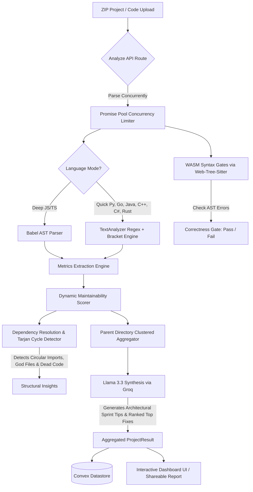

# CodeVitals 🩺

> **A multi-language project health analyzer with deterministic metrics, structured AI insight, and scan evolution tracking.**
>
> Unlike purely AI-based reviewers, every recommendation is grounded in measurable code metrics and structural analysis.
>
> Drop in a single file or an entire ZIP — CodeVitals scores your codebase, explains why, maps its import architecture, and tracks how it improves over time.

---

## 🏗️ System Architecture

CodeVitals operates on a hybrid static-analysis and LLM aggregation pipeline. The diagram below illustrates how files are loaded, parsed, checked, and aggregated:



---

## What Is This?

CodeVitals is a web platform that gives developers a structured maintainability score for their code, plus an explicit correctness gate. It uses:

- **WebAssembly Syntax Gates**: Secure, sandboxed WebAssembly language parsers powered by `web-tree-sitter` to check for syntax errors without spawning un-sandboxed local CLI binaries.
- **Static Analysis**: Babel-based AST analysis for Javascript/TypeScript, and high-performance regular-expression engines for other major backend languages.
- **Dependency & Structural Engines**: Finds circular import loops (Tarjan's SCC), God modules, and unreferenced dead code.
- **Explainable Scoring & AI Sprint Plans**: Transparently displays deductions for nested logical complexity, function length, duplication, and unused imports, and uses Llama 3.3 (via Groq) to synthesize folder-level refactoring sprint plans.
- **Evolution Tracking**: Leverages Convex to monitor maintainability gains across successive code scans.
- **Shareable Reports**: Public-facing scan reports with configurable visibility (summary vs. full breakdown) to share with teammates.

---

## Tech Stack

| Layer | Technology |
|-------|-----------|
| **Framework** | Next.js 14 (App Router) |
| **Language** | TypeScript |
| **Styling** | Vanilla CSS (premium custom dark-mode design system) |
| **Auth** | Clerk |
| **Database / Realtime** | Convex |
| **AI Synthesis** | Groq API — Llama 3.3 70B |
| **AST Parsing (Deep)** | Babel (`@babel/parser`, `@babel/traverse`, `@babel/types`) |
| **WASM Parser (Quick)** | `web-tree-sitter@0.20.8` (sandboxed parsing grammar engine) |
| **WASM Languages** | `tree-sitter-wasms` (Python, Go, Java, C++, Rust, C#) |
| **ZIP Handling** | adm-zip |
| **Large ZIP Uploads** | Vercel Blob (`@vercel/blob`) |
| **Charts & Diagrams** | Recharts (Trend Line), Mermaid.js (Module Coupling) |
| **Icons** | Lucide React |

---

## Project Structure

```
ai-project/
├── app/
│   ├── page.tsx                  # Landing page (Paste Code / Upload ZIP tabs)
│   ├── analyze/page.tsx          # Single-file results page
│   ├── project/page.tsx          # Multi-file project results page (with Share modal)
│   ├── dashboard/page.tsx        # Evolution tracking dashboard
│   ├── scan/[id]/page.tsx        # Public shareable scan report page
│   └── api/
│       ├── analyze/route.ts      # Single-file analysis endpoint
│       ├── analyze-zip/route.ts  # ZIP upload, promise pool, and AI synthesis API
│       ├── blob-upload/route.ts  # Vercel Blob token generator
│       └── save-scan/route.ts    # Save scan to Convex helper
│
├── lib/
│   ├── analyzer/
│   │   ├── parser.ts             # Babel AST parser (JS/TS)
│   │   ├── metrics.ts            # AST metric extraction
│   │   ├── scorer.ts             # Scoring engine (0–100, letter grades)
│   │   ├── textAnalyzer.ts       # Text-based token and import extractor
│   │   ├── syntaxCheck.ts        # WASM Web-Tree-Sitter syntax gate check
│   │   ├── aggregate.ts          # Dependency graph, cycle, and cluster compiler
│   │   └── types.ts              # Unified TS type declarations
│   ├── ai/
│   │   └── groq.ts               # Groq Llama 3.3 synthesis calls
│   └── db/
│       └── saveScan.ts           # Convex client save mutations wrapper
│
├── scripts/
│   └── copy-wasm.js              # Script to stage .wasm grammars in public/wasm/
│
├── convex/
│   ├── schema.ts                 # Convex Datastore Schema
│   └── scans.ts                  # Scan history & sharing resolver logic
│
└── components/
    └── analyzer/
        ├── ScoreGauge.tsx        # Dynamic health score ring
        ├── MetricsGrid.tsx       # Structural metrics list
        ├── IssueList.tsx         # Filterable code warnings list
        ├── Mermaid.tsx           # Client-rendered dependency graph SVG
        └── AIInsight.tsx         # Typewriter AI coaching block
```

---

## Dynamic Analysis Engine

### Correctness vs Maintainability
CodeVitals isolates code correctness from structural maintainability:
- **Correctness Gate**: Syntax parsing status (`pass/fail`) checked via pure Javascript (Babel) or sandboxed WebAssembly (Tree-sitter).
- **Maintainability Score**: Deterministic structural metrics (0–100) based on readability, cleanliness, structure, and nesting.

| Mode | Supported Languages | Correctness Gate | Maintainability Metrics |
|------|-----------|------------------|-----------------|
| **🔬 Deep** | JS/TS | Babel AST checker | Deep AST metrics |
| **⚡ Quick** | Python, Go, Java, C++, Rust, C# | Web-Tree-Sitter WASM checker | Text-based structural metrics |
| **⚡ Quick (Basic)** | HTML, CSS, Toml, YAML, Ruby | `unknown` | Basic line & token counts |

---

## Key Core Features

### 1. Explainable Scoring Engine
Located inside [scorer.ts](file:///Users/srinivasch/Documents/Projects/Codevitals/ai-project/lib/analyzer/scorer.ts), the maintainability score is computed by applying deterministic penalties to a starting score of 100:
- **Complexity**: Deducts up to `-25 pts` for cyclomatic complexity paths.
- **Function Length**: Deducts up to `-20 pts` for long, hard-to-scan functions.
- **Block Nesting Depth**: Deducts up to `-20 pts` for deeply nested conditionals and loops.
- **Duplication Percentage**: Deducts up to `-20 pts` for duplicate code blocks.
- **Unused Imports**: Deducts up to `-15 pts` for bloated declarations.

### 2. Dependency Graph & Tarjan's Cycles
Implemented in [aggregate.ts](file:///Users/srinivasch/Documents/Projects/Codevitals/ai-project/lib/analyzer/aggregate.ts), the engine maps how modules import one another and resolves next.js aliases (`@/`) and relative links. It extracts:
- **Circular Imports**: Identified using **Tarjan's Strongly Connected Components** algorithm to flag brittle import loops.
- **God Modules**: Identifies central hubs (heavy in-degree/out-degree and complex size).
- **Dead Code**: Detects zero-in-degree unreferenced files that are safe to prune.

### 3. Parent Directory Issue Clusters
Groups issues by their parent directory boundaries. LLMs synthesize directory-level refactoring recommendations for these folders, generating architectural sprint plans.

### 4. Ranked Top Fixes
Presents a sorted plan of the most critical structural issues across your workspace, categorized by `High`, `Medium`, and `Low` maintainability impact.

### 5. ZIP Concurrency Pool
Processes file analyses concurrently inside [route.ts](file:///Users/srinivasch/Documents/Projects/Codevitals/ai-project/app/api/analyze-zip/route.ts) with a concurrency-controlled Promise Pool, preventing main thread blockages.

---

## Running Locally

### 1. Stage WASM assets
Install packages first, which copies tree-sitter grammars automatically:
```bash
npm install
```

*Note: If you need to manually copy the WebAssembly assets to `/public/wasm/`, run:*
```bash
node scripts/copy-wasm.js
```

### 2. Set up environment variables
Create a `.env.local` file in the project root:
```env
NEXT_PUBLIC_CONVEX_URL=<your-convex-url>
NEXT_PUBLIC_CLERK_PUBLISHABLE_KEY=<clerk-publishable-key>
CLERK_SECRET_KEY=<clerk-secret-key>
GROQ_API_KEY=<groq-llama-api-key>
BLOB_READ_WRITE_TOKEN=<vercel-blob-token>
```

### 3. Start databases & Dev Server
```bash
# Push Convex schema
npx convex dev --once

# Run Next.js locally
npm run dev
```

---

## Roadmap & Progress

### ✅ Phase 1 — Single-File AST Analyzer (COMPLETE)
- AST-based metrics extraction for JS/TS.
- SVG gauge, letter grading, metrics grids, and typewriter AI coaching.

### ✅ Phase 2 — Multi-Language ZIP Analyzer (COMPLETE)
- Multi-file aggregate parser with macOS resource fork exclusions.
- Multi-dimension project report dashboard showing weight-adjusted scoring.
- Relative imports resolution.

### ✅ Phase 3 — Scan History & Shareable Reports (COMPLETE)
- Project evolution tracking dashboard with trend lines.
- Configurable report visibility (Summary vs. Full Report).

### ✅ Phase 4 — Better Engine: WASM Gates & Concurrency (COMPLETE)
- Tree-sitter integration for Python, Go, Java, C++, Rust, C# syntax checking.
- Sandboxed execution runs securely on serverless (Vercel) without spawning local shells.
- Custom Promise Pool implementation for zip parsing concurrency.

### 🔜 Phase 5 — GitHub Cloning Integration (PLANNED)
- Clone and analyze public Git repositories directly using HTTP URLs.
- Comparative delta dashboard showing code evolution branch-to-branch.

### 🔜 Phase 6 — Editor Integrations (PLANNED)
- VS Code extension showing maintainability metrics inline inside the editor.
