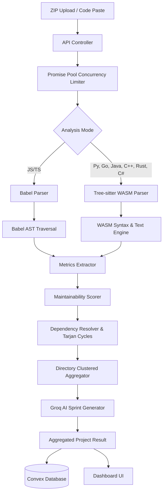
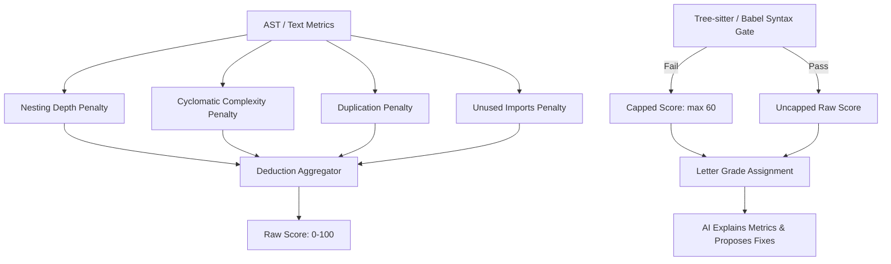
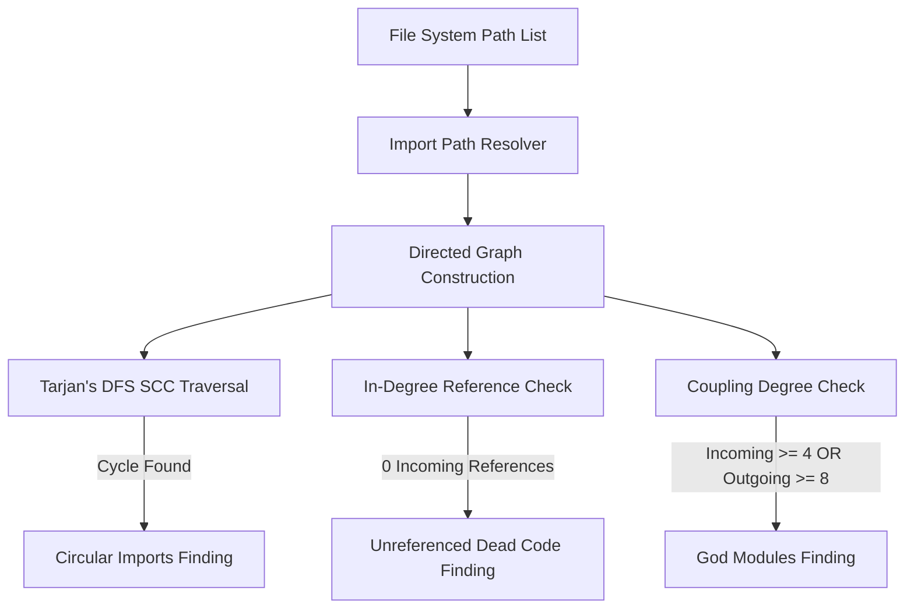

# Codentia 🩺

> **A multi-language project health analyzer with deterministic metrics, structured AI insight, and scan evolution tracking.**
>
> Unlike purely AI-based reviewers, every recommendation is grounded in measurable code metrics and structural analysis.
>
> Drop in a single file or an entire ZIP — Codentia scores your codebase, explains why, maps its import architecture, and tracks how it improves over time.

---

## 🚀 Key Features

*   **Explainable Maintainability Scoring**: Metric-based scoring (0-100) with clear, transparent deductions.
*   **WASM Syntax Gates**: Secure, sandboxed WebAssembly parsers (`web-tree-sitter`) checking syntax for Python, Go, Java, C++, Rust, and C# without spawning un-sandboxed shell processes.
*   **AST Deep Analysis**: JavaScript/TypeScript traversal checking nesting, function length, duplication, and unused imports.
*   **Tarjan's Circular Dependency Detector**: Linear-time cycle detection locating circular module imports.
*   **Structural Audits**: God modules and dead code detection.
*   **Parent Directory Clustering**: Folder-based aggregation of issues, with AI-synthesized sprint plans and prioritized fixes.
*   **Evolution Tracking**: Evolution banners and charts tracking your maintainability score scan-to-scan.
*   **Shareable Reports**: Public reports with adjustable visibility controls.

---

## 📖 How Codentia Works

When you upload a single source file or an entire project ZIP, Codentia processes your code through six distinct analysis stages:

```
[Upload] ➔ [Read & Decompress] ➔ [Parse Code] ➔ [Extract Metrics] ➔ [Graph & Analyze Cycles] ➔ [Calculate Scores] ➔ [AI Explanation] ➔ [Dashboard]
```

### Step 1 — Read the Project
The uploaded ZIP archive is decompressed in memory using `adm-zip`. Codentia filters out non-source file paths (like macOS resource forks `._*`, `.git`, `node_modules`, and lock files). Supported source files are placed in an entry queue. To keep the server responsive, files are processed concurrently using a bounded promise pool.

### Step 2 — Parse Every File
For each collected file, Codentia chooses the appropriate parsing path based on the file extension:

| Language | Mode | Parser |
| :--- | :--- | :--- |
| **JavaScript / TypeScript** | 🔬 Deep | Babel AST Parser (`@babel/parser`) |
| **Python** | ⚡ Quick | Tree-sitter WASM (`tree-sitter-python.wasm`) |
| **Go** | ⚡ Quick | Tree-sitter WASM (`tree-sitter-go.wasm`) |
| **Java** | ⚡ Quick | Tree-sitter WASM (`tree-sitter-java.wasm`) |
| **C++** | ⚡ Quick | Tree-sitter WASM (`tree-sitter-cpp.wasm`) |
| **Rust** | ⚡ Quick | Tree-sitter WASM (`tree-sitter-rust.wasm`) |
| **C#** | ⚡ Quick | Tree-sitter WASM (`tree-sitter-c_sharp.wasm`) |

The parser converts the flat code text into a structured Syntax Tree representing the hierarchical grammar of the source file.

### Step 3 — Extract Metrics
The syntax tree is walked to extract structural and maintainability metrics:
- **Logical Complexity**: Counting decision branches (conditionals, loops, switches).
- **Block Nesting Depth**: Tracking how deeply loops/conditionals are nested.
- **Function/Module Length**: Counting lines inside functions.
- **Imports Tracking**: Capturing imports to detect unused declarations and build the project's dependency graph.
- **Code Duplication**: Checking code blocks using a sliding window.

### Step 4 — Build Project Intelligence
After individual file metrics are compiled, Codentia builds a project-level dependency graph where files represent nodes and imports represent directed edges. The analyzer:
- Resolves Next.js root aliases (`@/`) and relative import pathways.
- Runs Tarjan's SCC algorithm on the directed graph to identify circular import loops.
- Flag God files (excessive in/out degree coupling) and dead code modules (0 incoming references).
- Groups issues by parent directories into folder-based directory clusters.

### Step 5 — Calculate Scores
The maintainability score is computed by applying transparent, deterministic deductions to a starting score of 100 based on the extracted metrics (see [Scoring Engine](#-scoring-engine) below). If the syntax parser flags errors, the file fails the **Correctness Gate** and its maintainability score is capped at `60` to signal a broken build.

### Step 6 — AI Explanation
Finally, the project metrics, structural findings, directory clusters, and correctness gates are passed to Llama 3.3 via Groq. **The AI does not invent or hallucinate the metrics.** Instead, it acts as an architectural coach: it reviews the static metrics, explains the root causes of deductions, generates sprint plan tips for directory clusters, and prioritizes the top fixes.

---

## 🏗️ System Architecture

### 1. Analysis Pipeline Flow
The following diagram illustrates how files flow from client upload to backend parsing, static analysis, AI coaching, and database storage:



### 2. Scoring Pipeline
Scoring penalties are computed deterministically prior to the AI pipeline:



### 3. Dependency Analysis Flow
The dependency analyzer maps project file couplings and isolates structural circular loops:



---

## ⚙️ Detailed Analysis Engine

Codentia operates in two analysis modes depending on the language:

### 1. 🔬 Deep Mode (JavaScript / TypeScript)
For JavaScript and TypeScript files, Codentia performs deep static analysis:
- **Babel AST Traversal**: Generates a full Abstract Syntax Tree.
- **Nesting Metrics**: Recursively walks loop structures (`ForStatement`, `WhileStatement`, `DoWhileStatement`) and conditional statements (`IfStatement`, `SwitchStatement`) to measure nesting depth.
- **Unused Import Identification**: Traverses `ImportSpecifier` bindings and checks if they are referenced anywhere in the module's scope, including JSX component declarations.

### 2. ⚡ Quick Mode (Python, Go, Java, C++, Rust, C#)
For other backend languages, Codentia uses a hybrid WebAssembly parser:
- **WASM Syntax Gates**: Dynamically loads compiled language grammars (`tree-sitter-python.wasm`, `tree-sitter-go.wasm`, etc.) via `web-tree-sitter` in a secure sandbox.
- **Syntax Error Tracing**: Traverses the syntax tree for `ERROR` nodes and `isMissing()` tokens to capture exact syntax error messages, line numbers, and column offsets.
- **Regex Metric Extraction**: Identifies function boundaries, parameters, nesting blocks, and line metrics using language-specific regular expressions when full ASTs are unavailable.

---

## 🧮 Scoring Engine

### Deduction Formula
The score starts at **100** and is adjusted by subtracting the following penalties:

| Metric | Threshold | Penalty Calculation | Max Deduction |
| :--- | :--- | :--- | :--- |
| **Cyclomatic Complexity** | `> 1` | `(avg_complexity - 1) * 8` | `-25 pts` |
| **Function Length** | `> 20 lines` | `(avg_lines - 20) * 1.2` | `-20 pts` |
| **Nesting Depth** | `> 2 layers` | `(max_nesting - 2) * 15` | `-20 pts` |
| **Duplication** | `> 0%` | `duplication_percentage * 2` | `-20 pts` |
| **Unused Imports** | `> 0` | `unused_imports * 10` | `-15 pts` |

### Concrete Code Example

#### Input (Bad Python Code):
```python
def process_data(a, b, c, d, e, f, g):  # ❌ Too many parameters (7)
    # Nesting Depth 5 ❌
    if a:
        for item in b:
            if c:
                while d:
                    if e:
                        print("Item found:", item)  # ❌ Deep nesting
```

#### Codentia Scorecard:
- **Correctness Gate**: `Pass` (Valid Python syntax).
- **Extracted Metrics**: Nesting Depth: `5`, Parameter Count: `7`.
- **Deductions Applied**:
  - Nesting Depth Penalty: `-20 pts` (Max nesting capped at threshold).
  - Complexity Penalty: `-15 pts` (Complexity paths from nested statements).
- **Final Maintainability Score**: **65 / 100** (Grade: **Fair**).
- **AI Recommendation**: *"Flatten conditional nesting in `process_data`. Extract the inner loop logic into a helper function and consolidate the 7 parameters into a configuration object."*

---

## 🔬 Structural Analysis ("Why It Matters")

Codentia incorporates two structural algorithms designed for high-performance codebase analysis:

### 1. Tarjan's Strongly Connected Components (SCC)
- **What it is**: A graph algorithm that finds circular subgraphs in a single depth-first search (DFS) pass.
- **Why it matters**: Circular dependencies (`A ➔ B ➔ A`) tightly couple modules, making them brittle, hard to test, and difficult to refactor. Codentia runs Tarjan's algorithm to identify these cycles in linear time **$O(V + E)$**, mapping loops on your dashboard without blocking the API handler.

### 2. Promise Pool Concurrency Limiter
- **What it is**: A custom promise pool that limits active file analysis operations.
- **Why it matters**: Analyzing large project uploads synchronous-style blocks the single-threaded Node.js event loop. Using unrestricted `Promise.all` can crash Vercel serverless containers due to CPU spikes or out-of-memory issues. Codentia uses a **concurrency limit of 6** to process files in parallel, keeping memory usage low and response times fast.

---

## 🤖 AI Pipeline: Why Not Just Use AI?

AI code reviewers often suffer from hallucinations and inconsistent metrics. Codentia solves this by using a hybrid **Metrics-First** architecture:

```
[Traditional AI Reviewer] ➔ Raw Code ➔ Pure LLM Interpretation ➔ Opinion-Based Feedback (Unstable)

[Codentia Pipeline]     ➔ Raw Code ➔ Static WASM AST ➔ Deterministic Evidence ➔ LLM Explanation (Stable)
```

| Aspect | Traditional AI Reviewer | Codentia |
| :--- | :--- | :--- |
| **Consistency** | Low (scores change query-to-query) | High (scores are deterministic) |
| **Refactoring Source** | Guessed by AI | Grounded in metrics (duplication, cyclomatic complexity) |
| **Performance** | High latency (needs multiple LLM hops) | Fast (static metrics run locally; AI only synthesizes results) |
| **Security** | Sends raw code to external LLM | Sends only metadata/metrics and issue snippets |

---

## 📂 Project Structure

*(Refer to the [Project Structure](#project-structure) section above.)*

---

## 🛠️ Running Locally

### 1. Clone & Install Dependencies
Ensure you install dependencies, which will trigger the copy script for WASM grammar files:
```bash
npm install
```

To manually copy the WASM files to `/public/wasm/`:
```bash
node scripts/copy-wasm.js
```

### 2. Environment Configuration
Create a `.env.local` file in your root folder:
```env
NEXT_PUBLIC_CONVEX_URL=https://<your-project>.convex.cloud
NEXT_PUBLIC_CLERK_PUBLISHABLE_KEY=pk_test_...
CLERK_SECRET_KEY=sk_test_...
GROQ_API_KEY=gsk_...
BLOB_READ_WRITE_TOKEN=vercel_blob_rw_...
```

### 3. Database Sync & Run
```bash
# Push Convex schema
npx convex dev --once

# Start development server
npm run dev
```
Open `http://localhost:3000` to view the platform.

---

## 📊 Self-Analysis Benchmark

To validate the analyzer's accuracy, Codentia scanned its own `lib/` folder:
- **97/100 — Excellent** overall maintainability score.
- Correctly identified [metrics.ts](file:///Users/srinivasch/Documents/Projects/Codentia/ai-project/lib/analyzer/metrics.ts) as the weakest file (**83/100**) due to a highly nested 17-path cyclomatic complexity routine.
- Correctly identified [aggregate.ts](file:///Users/srinivasch/Documents/Projects/Codentia/ai-project/lib/analyzer/aggregate.ts) as a God file candidate due to high import-coupling.

---

## 🧠 Design Decisions

- **Why static metrics first?** Grounding recommendations in concrete, AST-derived numbers builds developer trust and guarantees reproducible grades.
- **Why no AST parsing for non-JS/TS files?** Building and maintaining full compiler ASTs for Python, C++, Go, and Rust would expand the scope and increase latency. WebAssembly Tree-sitter grammars provide syntax checks and structural complexity metrics with minimal overhead.
- **Why use Convex for history?** Real-time mutations allow users to see their project score improve scan-to-scan instantly without page reloads.

---

## 🗺️ Roadmap

- **Phase 1: AST Parser & Deductions Engine** (COMPLETE)
- **Phase 2: Multi-Language ZIP Uploads & Resource Fork Filters** (COMPLETE)
- **Phase 3: Convex History, Dashboard Trends, & Shareable Reports** (COMPLETE)
- **Phase 4: WebAssembly Syntax Checking Gates & Promise Pooling** (COMPLETE)
- **Phase 5: GitHub Repository URL Cloning & Delta Analysis** (PLANNED)
- **Phase 6: VS Code Extension Inline Metrics Sidebar** (PLANNED)

---

## 📄 License
This project is licensed under the MIT License - see the LICENSE file for details.
